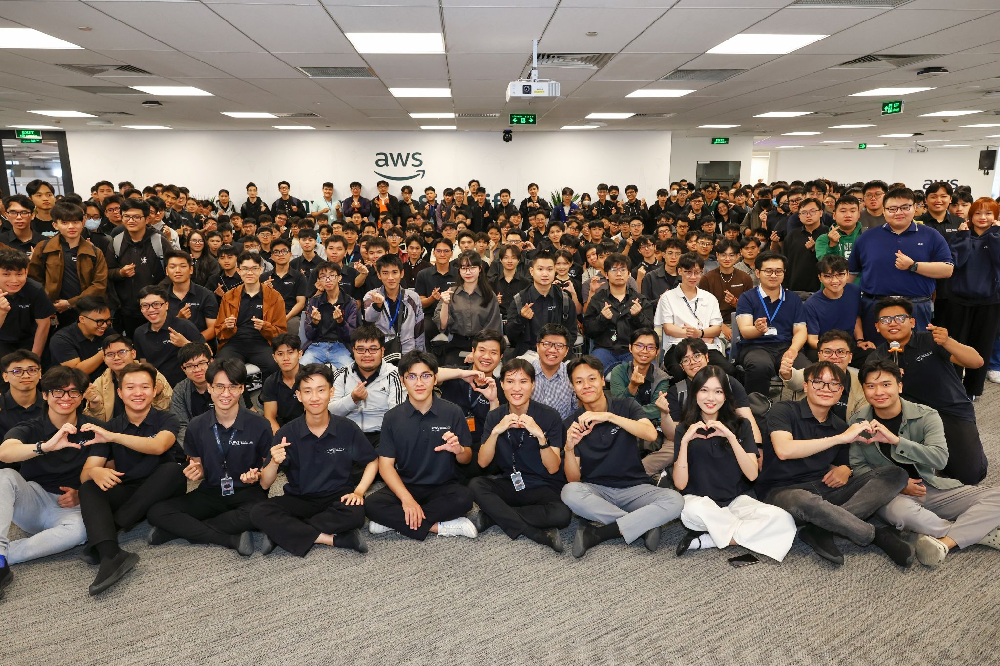

# Summary Report: FCAJ Meetup 06-06-2026

**Date:** June 6, 2026  
**Format:** In-person community meetup  
**Location:** 26th Floor, Bitexco Tower, 02 Hai Trieu Street, Ho Chi Minh City  
**Organizer:** First Cloud & AI Journey (FCAJ) Community

---

### Event Objectives

- Create a space for community members to share technical knowledge and personal experiences
- Introduce practical projects and real-world applications of Cloud and AI technologies
- Inspire learners with stories of career growth in the tech industry
- Foster networking among members with diverse backgrounds and skill sets

---

### Speakers & Topics

| # | Speaker | Topic |
|---|---------|-------|
| 1 | **Mr. Nguyễn Quốc Bảo** | Rock Paper Scissors with AWS WebSocket – Real-time Multiplayer Game |
| 2 | **Mr. Huỳnh Nguyễn Quốc Bảo** | Docker Basics – Virtualization & Containerization |
| 3 | **Mr. Đinh Việt Phát** | GraphRAG – Graph-based Retrieval Augmented Generation |
| 4 | **Mr. Lê Hoàng Gia Đại** | AWS WAF & ML-based Network Intrusion Detection System (NIDS) |
| 5 | **Mr. Vinh Trần** | From IT Helpdesk to Senior Sysadmin – A Career Journey |

---

### Key Highlights

#### Talk 1 – Rock Paper Scissors with AWS WebSocket (Real-time Multiplayer)

Built using **Godot 4** (game engine) as the client and a fully serverless AWS backend:

- **API Gateway WebSocket** routes connections via `$connect`, `$disconnect`, and `$default` route keys, reading `$request.body.action` to determine game logic paths
- **AWS Lambda** handles matchmaking (pairing waiting players) and game result resolution
- **Amazon DynamoDB** stores connection state — each player's `connectionId`, status (`waiting`/`matched`), opponent ID, and choice (rock/paper/scissors)
- Key challenges encountered:
  - **GoneException**: Disconnected players may linger in DynamoDB, causing failed message pushes
  - **DynamoDB Scan cost**: ScanCommand checks every player as the table grows
  - **Stateless Lambda**: Game state must be fetched from DynamoDB on every invocation
- **Next steps**: Transition to **AWS GameLift** for games requiring dedicated servers, high-frequency updates, or real-time physics

#### Talk 2 – Docker Basics (Virtualization & Containerization)

Speaker: **Bảo Huynh** – Junior Cloud Native Developer at Endava Vietnam, Founder of ITea Lab

- Explained the difference between **Virtual Machines** (each with its own OS, heavy resource use) and **Containers** (lightweight, share the host OS kernel)
- Key Docker concepts:
  - **Dockerfile** defines build steps; each instruction creates an immutable **image layer** — Docker reuses unchanged layers from cache to speed up builds
  - **Docker Images** are blueprints; **Containers** are running instances of those images
  - Containers are isolated from the host system and controlled via Docker CLI commands
- **Use cases**: CI/CD pipelines, microservices, development/testing environments, cloud-native applications, legacy app modernization
- Core benefit: *"Build once, run anywhere"* — consistent behavior across dev, staging, and production environments

#### Talk 3 – GraphRAG (Graph Retrieval Augmented Generation)

Speaker: **Đinh Việt Phát** – AI student at Swinburne University of Technology

- Standard **RAG** (Retrieval-Augmented Generation): retrieves relevant text passages from a vector database and injects them into an LLM prompt — but struggles with **multi-hop reasoning** (e.g., "Where is the company headquartered that was acquired by the company founded by Jeff Bezos?")
- **GraphRAG** solves this by explicitly storing **entity relationships as graph edges**, enabling traversal across multiple entities and documents
- Two implementation approaches on AWS:
  - **Fully Managed Route**: **Amazon Bedrock Knowledge Bases** (handles chunking, entity extraction, embeddings) + **Amazon Neptune Analytics** (graph storage, relationship discovery)
  - **Custom Route**: **LlamaIndex** for custom processing pipeline + **Amazon Neptune** for graph storage, multi-hop traversal, and Cypher queries
- Key benefits: superior performance on complex, relational queries where flat vector search falls short

#### Talk 4 – AWS WAF & ML-based NIDS

Speaker: **Lê Hoàng Gia Đại** – Final-year student at HUTECH University

- **AWS WAF** (Web Application Firewall) protects CloudFront, ALB, API Gateway, and Cognito via Web ACLs and rules (Allow/Block/Count/CAPTCHA). Strength: effective against known attacks. Limitation: struggles against zero-day, hybrid, and spoofing attacks.
- Built a **Machine Learning-based NIDS** using the **CSE-CIC-IDS2018 dataset** (from University of New Brunswick) covering attack types: DDoS, DoS, Brute Force, SQL Injection, XSS, Bot traffic, etc.
- Model: **LightGBM** — trained after preprocessing (handling NaN/infinity values, class balancing, feature selection)
- Full AWS architecture: **VPC → EC2 → ALB → AWS WAF → Lambda → Kinesis Data Firehose → S3 → Security Hub + GuardDuty + Inspector → SNS alerts → CloudWatch monitoring**
- Key lessons: data quality is critical; class imbalance handling improves minority attack detection; ML-based NIDS **complements** rather than replaces AWS WAF

#### Talk 5 – From IT Helpdesk to Senior Sysadmin

Speaker: **Tran Trung Vinh** – System Administrator at Central Retail Group

- Career path: IT Helpdesk → Sysadmin → Cloud/DevOps Engineer
- Skills gained from Helpdesk: troubleshooting under pressure, user communication, problem-solving mindset
- Life as a Sysadmin: server provisioning, network management, security patching, capacity planning
  - **Golden rule**: *"Never test in production — protect availability, trust, and your team's time"*
- Transition to Cloud/DevOps: moved from manual on-premise configs to **AWS elastic scaling**, **Terraform** (IaC), **CI/CD pipelines**, and **Docker**
- Interview tips at Central Retail Group: focus on real projects, highlight practical skills, prepare for incident response and architecture design scenarios
- Career advice:
  - *Go deep on 1–2 core areas first before spreading wide*
  - *A real portfolio matters more than certifications*
  - *Where you start doesn't matter — keep going. Every small step counts.*

---

### Key Takeaways

#### Technical Concepts

- **AWS WebSocket + Lambda + DynamoDB**: A scalable, serverless combo for turn-based real-time applications; AWS GameLift is the next step for high-frequency games
- **Docker layers & caching**: Understanding how image layers work is key to writing efficient Dockerfiles and speeding up CI/CD pipelines
- **GraphRAG vs. RAG**: GraphRAG uses Amazon Neptune to store entity relationships as graph edges, enabling multi-hop reasoning that flat vector search cannot do
- **ML for Security**: LightGBM-based NIDS + AWS WAF provides layered, adaptive security — signature rules handle known threats, ML handles novel ones
- **Infrastructure as Code**: Terraform makes cloud infrastructure repeatable, version-controlled, and scalable

#### Career & Mindset

- **Career transitions are possible** with the right roadmap and relentless learning — Vinh Trần's story is proof
- **Hands-on projects** (like the WebSocket multiplayer game) are the fastest way to internalize cloud concepts
- **Community learning** accelerates growth — sharing and receiving knowledge in a peer environment is highly effective

---

### Applying to Work

- Explore **AWS API Gateway WebSocket + Lambda** for future real-time features (notifications, live dashboards)
- Practice writing **efficient Dockerfiles** — understand layer caching to speed up builds
- Investigate **GraphRAG with Amazon Bedrock + Neptune** for knowledge-intensive AI features
- Consider combining **AWS WAF rules with an ML-based NIDS** for smarter security in production
- Build a **personal learning roadmap** — pick 1–2 core areas, build real projects, document everything

---

### Event Experience

Attending the first **FCAJ Meetup** was a genuinely exciting experience. Unlike formal workshops or training sessions, this event had the energy of a passionate community coming together to learn and share.

#### Diverse and practical presentations

Each talk was grounded in real, hands-on experience — from building an actual multiplayer game on AWS to walking through a genuine career climb from helpdesk to senior engineer. Every session was immediately relatable and actionable.

#### AWS ecosystem exposure

The meetup naturally covered multiple AWS services across different domains — **API Gateway, Lambda, DynamoDB, WAF, Bedrock, Neptune, GuardDuty, Kinesis** — giving me a broader picture of how these services can be combined in real-world architectures.

#### Expanding my understanding of AI

The **GraphRAG** session was a standout. It reframed how I think about AI information retrieval — moving beyond flat vector search to structured, graph-based knowledge extraction. Learning about the difference between the Fully Managed route (Bedrock + Neptune Analytics) and the Custom route (LlamaIndex + Neptune) gave me a concrete starting point to experiment with.

#### Inspiration from career stories

**Vinh Trần's journey** from IT Helpdesk to Senior Sysadmin at Central Retail Group was one of the most memorable moments of the night. His framework for handling incidents as a Sysadmin — *understand the system, minimize damage, fix the root cause, never test in production* — is something I'll carry with me. It reinforced that technical depth, persistence, and a clear direction can take anyone far in this industry.

#### Lessons learned

- **Real projects teach real lessons** — the WebSocket game demo showed how theory becomes practice when you actually build something end-to-end
- **Docker is more powerful than I thought** — layer caching, multi-platform deployment, and container inspection add depth beyond just "packaging apps"
- **ML complements rule-based systems** — AWS WAF alone isn't enough; combining it with ML-based NIDS creates genuinely adaptive security
- **Community is a multiplier** — being in a room with people who are building, shipping, and growing creates an energy that's hard to replicate online

#### Some event photos

> Overall, FCAJ Meetup was an energizing kickoff to my community learning journey. The diversity of topics — from game development to AI to career growth — showed just how broad and exciting the Cloud & AI landscape is. I left with new ideas, new connections, and a renewed drive to keep building.
