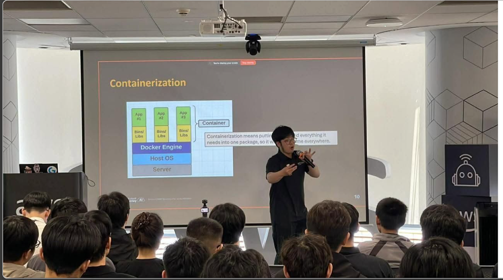

# Bài Thu Hoạch: Buổi gặp gỡ FCAJ 06-06-2026

**Ngày tổ chức:** 6 tháng 6, 2026  
**Hình thức:** Gặp mặt trực tiếp  
**Địa điểm:** Tầng 26, Tòa nhà Bitexco, 02 Hải Triều, Phường Bến Nghé, TP. Hồ Chí Minh  
**Ban tổ chức:** Cộng đồng First Cloud & AI Journey (FCAJ)

---

### Mục Đích Của Sự Kiện

- Tạo không gian để các thành viên trong cộng đồng chia sẻ kiến thức kỹ thuật và kinh nghiệm thực tế
- Giới thiệu các dự án thực tế và ứng dụng của công nghệ Cloud và AI
- Truyền cảm hứng qua những câu chuyện thăng tiến nghề nghiệp trong ngành công nghệ
- Kết nối các thành viên đến từ nhiều lĩnh vực và nền tảng khác nhau

---

### Danh Sách Diễn Giả & Chủ Đề

| STT | Diễn giả | Chủ đề |
|-----|----------|--------|
| 1 | **Mr. Nguyễn Quốc Bảo** | Rock Paper Scissors với AWS WebSocket – Game Multiplayer Real-time |
| 2 | **Mr. Huỳnh Nguyễn Quốc Bảo** | Docker Basics – Ảo hóa & Container hóa |
| 3 | **Mr. Đinh Việt Phát** | GraphRAG – Truy xuất thông tin dựa trên đồ thị tri thức |
| 4 | **Mr. Lê Hoàng Gia Đại** | AWS WAF & NIDS dùng Machine Learning |
| 5 | **Mr. Vinh Trần** | Từ IT Helpdesk đến Senior Sysadmin – Hành trình sự nghiệp |

---

### Nội Dung Nổi Bật

#### Talk 1 – Rock Paper Scissors với AWS WebSocket (Multiplayer Real-time)

Sử dụng **Godot 4** làm client game và kiến trúc serverless hoàn toàn trên AWS:

- **API Gateway WebSocket** định tuyến kết nối qua `$connect`, `$disconnect`, `$default`, đọc trường `action` trong JSON body để xác định luồng xử lý game
- **AWS Lambda** xử lý ghép cặp người chơi (matchmaking) và tính toán kết quả game
- **Amazon DynamoDB** lưu trạng thái kết nối — `connectionId`, status (`waiting`/`matched`), `opponentId`, và `choice` (rock/paper/scissors) của từng người chơi
- Các thách thức gặp phải trong thực tế:
  - **GoneException**: Người chơi đã ngắt kết nối vẫn còn trong DynamoDB, gây lỗi khi Lambda cố gửi tin nhắn
  - **DynamoDB Scan cost**: ScanCommand duyệt toàn bộ bảng, tốn kém và chậm khi số người chơi tăng
  - **Stateless Lambda**: Mỗi lần gọi phải fetch lại trạng thái game từ DynamoDB
- **Bước tiếp theo**: Chuyển sang **AWS GameLift** cho các game cần server chuyên dụng, cập nhật tần suất cao, hoặc mô phỏng vật lý thời gian thực

#### Talk 2 – Docker Basics (Ảo hóa & Container hóa)

Diễn giả: **Bảo Huynh (Huỳnh Nguyễn Quốc Bảo)** – Junior Cloud Native Developer tại Endava Vietnam, Founder của ITea Lab

- Giải thích sự khác biệt giữa **Virtual Machine** (mỗi VM có OS riêng, tốn tài nguyên) và **Container** (nhẹ hơn, chia sẻ kernel của host OS)
- Các khái niệm Docker cốt lõi:
  - **Dockerfile** định nghĩa các bước build; mỗi lệnh tạo ra một **image layer** bất biến — Docker tái sử dụng các layer chưa thay đổi từ cache để tăng tốc build
  - **Docker Images** là bản thiết kế; **Containers** là các instance đang chạy của image đó
  - Container chạy độc lập với máy host và được điều khiển qua Docker CLI
- **Các use case thực tế**: CI/CD pipelines, microservices, môi trường dev/test, ứng dụng cloud-native, hiện đại hóa ứng dụng legacy
- Lợi ích cốt lõi: *"Build once, run anywhere"* — hành vi nhất quán từ môi trường dev đến staging đến production

#### Talk 3 – GraphRAG (Graph Retrieval Augmented Generation)

Diễn giả: **Đinh Việt Phát** – Sinh viên chuyên ngành AI tại Swinburne University of Technology

- **RAG truyền thống**: Truy xuất đoạn văn bản liên quan từ vector database và đưa vào prompt LLM — nhưng yếu trong các câu hỏi đòi hỏi **suy luận đa bước** (ví dụ: "Trụ sở của công ty được mua lại bởi công ty do Jeff Bezos sáng lập ở đâu?")
- **GraphRAG** giải quyết bằng cách lưu trữ **mối quan hệ giữa các thực thể dưới dạng cạnh đồ thị**, cho phép duyệt qua nhiều thực thể và tài liệu liên quan
- Hai hướng triển khai trên AWS:
  - **Fully Managed Route**: **Amazon Bedrock Knowledge Bases** (tự động chunk, entity extraction, tạo embeddings) + **Amazon Neptune Analytics** (lưu đồ thị, khám phá mối quan hệ)
  - **Custom Route**: **LlamaIndex** để xây dựng pipeline tùy chỉnh + **Amazon Neptune** để lưu Knowledge Graph, thực hiện multi-hop traversal và Cypher Query
- Ưu điểm vượt trội: xử lý tốt các câu hỏi phức tạp, nhiều quan hệ mà vector search thuần túy không thể giải quyết

#### Talk 4 – AWS WAF & ML-based NIDS

Diễn giả: **Lê Hoàng Gia Đại** – Sinh viên năm cuối trường Đại học HUTECH

- **AWS WAF** bảo vệ CloudFront, ALB, API Gateway và Cognito qua Web ACLs và rules (Allow/Block/Count/CAPTCHA). Điểm mạnh: hiệu quả với các tấn công đã biết. Hạn chế: yếu trước zero-day, hybrid và spoofing attacks.
- Xây dựng **NIDS dựa trên Machine Learning** sử dụng dataset **CSE-CIC-IDS2018** (từ Đại học New Brunswick) bao gồm các loại tấn công: DDoS, DoS, Brute Force, SQL Injection, XSS, Bot traffic...
- Model: **LightGBM** — được huấn luyện sau khi tiền xử lý dữ liệu (xử lý NaN/vô cực, cân bằng lớp, chọn đặc trưng)
- Kiến trúc AWS đầy đủ: **VPC → EC2 → ALB → AWS WAF → Lambda → Kinesis Data Firehose → S3 → Security Hub + GuardDuty + Inspector → SNS alerts → CloudWatch monitoring**
- Bài học quan trọng: chất lượng dữ liệu là yếu tố then chốt; xử lý class imbalance cải thiện khả năng phát hiện tấn công thiểu số; ML-based NIDS **bổ sung** cho AWS WAF chứ không thay thế

#### Talk 5 – Từ IT Helpdesk đến Senior Sysadmin

Diễn giả: **Trần Trung Vinh** – System Administrator tại Central Retail Group

- Lộ trình sự nghiệp: IT Helpdesk → Sysadmin → Cloud/DevOps Engineer
- Kỹ năng học được từ giai đoạn Helpdesk: xử lý sự cố dưới áp lực, giao tiếp với người dùng, tư duy giải quyết vấn đề
- Công việc hàng ngày của Sysadmin: provisioning server, quản lý hạ tầng mạng, vá bảo mật, lập kế hoạch dung lượng
  - **Quy tắc vàng**: *"Không bao giờ test trên production — bảo vệ tính khả dụng, niềm tin và thời gian của cả team"*
- Chuyển sang Cloud/DevOps: từ cấu hình thủ công on-premise sang **AWS elastic scaling**, **Terraform** (IaC), **CI/CD pipelines** và **Docker**
- Kinh nghiệm phỏng vấn tại Central Retail Group: tập trung vào dự án thực tế, kỹ năng xử lý sự cố, thiết kế kiến trúc
- Lời khuyên sự nghiệp:
  - *Đi sâu vào 1–2 lĩnh vực cốt lõi trước khi mở rộng*
  - *Portfolio thực tế có giá trị hơn chứng chỉ*
  - *Nơi bạn bắt đầu không quan trọng — hãy tiếp tục tiến lên. Mỗi bước nhỏ đều có ý nghĩa.*

---

### Những Gì Học Được

#### Kiến Thức Kỹ Thuật

- **AWS WebSocket + Lambda + DynamoDB**: Bộ ba serverless cho ứng dụng real-time turn-based; AWS GameLift là bước tiếp theo cho game tần suất cao
- **Docker layers & caching**: Hiểu cách image layers hoạt động giúp viết Dockerfile hiệu quả và tăng tốc CI/CD pipeline
- **GraphRAG vs. RAG**: GraphRAG dùng Amazon Neptune lưu quan hệ thực thể dạng cạnh đồ thị, cho phép suy luận đa bước mà vector search thuần không làm được
- **ML cho bảo mật**: LightGBM-based NIDS + AWS WAF tạo lớp bảo mật thích ứng — quy tắc signature xử lý mối đe dọa đã biết, ML xử lý mối đe dọa mới
- **Infrastructure as Code**: Terraform giúp hạ tầng cloud có thể tái sử dụng, kiểm soát phiên bản và mở rộng dễ dàng

#### Sự Nghiệp & Tư Duy

- **Chuyển đổi nghề nghiệp là hoàn toàn khả thi** nếu có lộ trình đúng đắn và tinh thần học hỏi không ngừng — câu chuyện của Vinh Trần là minh chứng sống
- **Dự án thực tế** (như game WebSocket multiplayer) là cách nhanh nhất để nắm vững các khái niệm cloud
- **Học tập cộng đồng** tăng tốc sự phát triển — chia sẻ và tiếp nhận kiến thức trong môi trường ngang hàng mang lại hiệu quả cao

---

### Ứng Dụng Vào Công Việc

- Khám phá **AWS API Gateway WebSocket + Lambda** cho các tính năng real-time (thông báo, live dashboard)
- Thực hành viết **Dockerfile hiệu quả** — hiểu layer caching để tăng tốc build
- Tìm hiểu **GraphRAG với Amazon Bedrock + Neptune** cho các tính năng AI xử lý tri thức phức tạp
- Cân nhắc kết hợp **AWS WAF với ML-based NIDS** cho bảo mật thông minh hơn ở môi trường production
- Xây dựng **lộ trình học tập cá nhân** — chọn 1–2 lĩnh vực cốt lõi, làm dự án thực tế, ghi chép và chia sẻ

---

### Trải Nghiệm Trong Sự Kiện

Tham gia **FCAJ Meetup #1** là một trải nghiệm thực sự thú vị. Không giống như các workshop hay khóa đào tạo chính thức, sự kiện này mang năng lượng của một cộng đồng đam mê cùng nhau học hỏi và chia sẻ.

#### Các bài trình bày đa dạng và thực tế

Mỗi bài nói đều xuất phát từ kinh nghiệm thực chiến — từ việc xây dựng thực sự một game multiplayer trên AWS đến hành trình thực tế leo từ helpdesk lên senior engineer. Điều này khiến mỗi phiên trình bày đều gần gũi và có thể áp dụng ngay.

#### Tiếp xúc với hệ sinh thái AWS

Meetup này tự nhiên bao quát nhiều lớp dịch vụ AWS — **API Gateway, Lambda, DynamoDB, WAF, Bedrock, Neptune, GuardDuty, Kinesis** — giúp tôi có bức tranh rộng hơn về cách các dịch vụ này kết hợp với nhau trong kiến trúc thực tế.

#### Mở rộng hiểu biết về AI

Phiên **GraphRAG** là điểm sáng đối với tôi. Nó thay đổi cách tôi nghĩ về truy xuất thông tin AI — vượt ra ngoài tìm kiếm vector phẳng để đến với việc trích xuất tri thức dựa trên đồ thị có cấu trúc. Tìm hiểu về sự khác biệt giữa Fully Managed Route (Bedrock + Neptune Analytics) và Custom Route (LlamaIndex + Neptune) cho tôi điểm khởi đầu cụ thể để thực hành.

#### Cảm hứng từ câu chuyện sự nghiệp

**Hành trình của Vinh Trần** từ IT Helpdesk đến Senior Sysadmin tại Central Retail Group là một trong những khoảnh khắc đáng nhớ nhất của buổi tối. Framework của anh ấy để xử lý sự cố: *hiểu hệ thống, giảm thiểu thiệt hại, tìm nguyên nhân gốc rễ, không bao giờ test trên production* — là thứ tôi sẽ mang theo. Nó củng cố rằng chiều sâu kỹ thuật, sự kiên trì và định hướng rõ ràng có thể đưa bất kỳ ai đi xa trong ngành này.

#### Bài Học Rút Ra

- **Dự án thực dạy bài học thực** — demo game WebSocket cho thấy lý thuyết trở thành thực hành như thế nào khi bạn thực sự build end-to-end
- **Docker mạnh mẽ hơn tôi nghĩ** — layer caching, multi-platform deployment và kiểm tra container thêm vào độ sâu vượt ra ngoài việc chỉ "đóng gói app"
- **ML bổ sung cho hệ thống dựa trên quy tắc** — AWS WAF một mình là chưa đủ; kết hợp với ML-based NIDS tạo ra bảo mật thực sự thích ứng
- **Cộng đồng là chất nhân** — ở trong một phòng với những người đang xây dựng, triển khai và phát triển tạo ra một năng lượng khó có thể tái tạo khi học online

#### Một Số Hình Ảnh Khi Tham Gia Sự Kiện

> Tổng thể, FCAJ Meetup là một khởi đầu đầy năng lượng cho hành trình học tập cộng đồng của tôi. Sự đa dạng của các chủ đề — từ phát triển game đến AI đến sự nghiệp — cho thấy Cloud & AI rộng lớn và thú vị như thế nào. Tôi ra về với những ý tưởng mới, kết nối mới và động lực mới để tiếp tục xây dựng.
