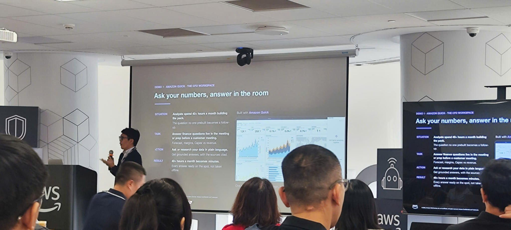
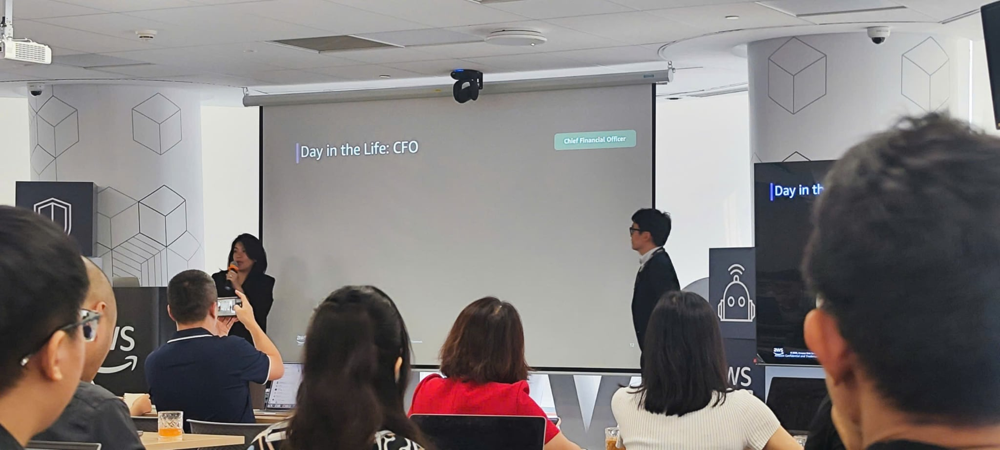
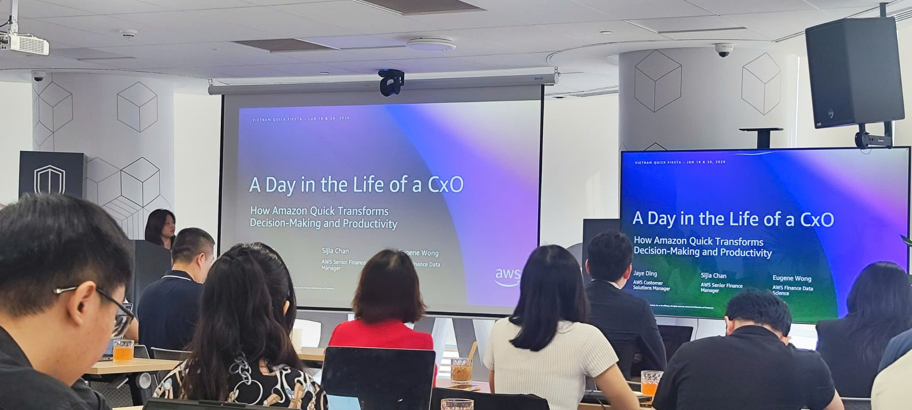

# Bài Thu Hoạch: Amazon Quick & Kiro Fiesta Vietnam 2026 #2

**Ngày tổ chức:** 19 tháng 6, 2026  
**Địa điểm:** Văn phòng AWS Việt Nam (Tòa nhà Bitexco, TP. HCM)  
**Hình thức:** Workshop thực hành (Hands-on Lab)  

---

### Tổng Quan Sự Kiện
Tôi đã tham gia phiên buổi sáng của sự kiện **"Amazon Quick & Kiro Fiesta Vietnam 2026 #2"** với chủ đề "A Day in the Life of a CxO". Mặc dù nội dung sự kiện chủ yếu được thiết kế dành cho các cấp quản lý (CEO, CIO, CFO) và chuyên gia tài chính, đây vẫn là một cơ hội tuyệt vời để tôi được trực tiếp trải nghiệm các công cụ AI mới nhất từ AWS.

### Diễn Giả Phiên Buổi Sáng
- **Miss. Jaye Ding** – Customer Solutions Manager
- **Miss. Sijia Chan** – AWS Finance
- **Mr. Eugene Wong** – AWS Finance

---

### Thực Hành: Agentic AI trong Tài Chính
Trọng tâm của buổi sáng là bài thực hành (hands-on) **"Agentic AI for Finance: T&E Analytics with Amazon Quick"**. Sử dụng tập dữ liệu giả định về Chi phí Đi lại (Travel and Expense - T&E) gồm 3.000 bản ghi, tôi đã được khám phá các tính năng AI của Amazon Quick mà không cần phải viết code. Các thao tác tôi đã thực hiện bao gồm:

- **Build Agent:** Tạo một AI agent tùy chỉnh có khả năng trả lời các câu hỏi bằng ngôn ngữ tự nhiên về dữ liệu chi phí.
- **Quick Flows:** Xây dựng luồng công việc (workflow) bằng AI để chuyển đổi dữ liệu thô thành các hành động cụ thể.
- **Quick Research:** Chạy phân tích đa bước chuyên sâu trên tập dữ liệu.
- **Build Quick App:** Đóng gói toàn bộ quy trình phân tích thành một ứng dụng tương tác đơn giản.

---

### Trải Nghiệm Cá Nhân
Vì phiên buổi sáng thiên về hướng quản trị doanh nghiệp và ra quyết định, tôi không thu nhặt được quá nhiều kiến thức thuần túy về mặt technical. Tuy nhiên, việc được "làm quen" và thao tác thực tế với một sản phẩm AI hoàn toàn mới như Amazon Quick lại vô cùng thú vị. Nó cho thấy sức mạnh của AI trong việc bình dân hóa việc phân tích dữ liệu, cho phép người dùng tạo ra các dashboard phức tạp và tự động hóa báo cáo chỉ bằng vài dòng mô tả.

---

### Một Số Hình Ảnh Sự Kiện

