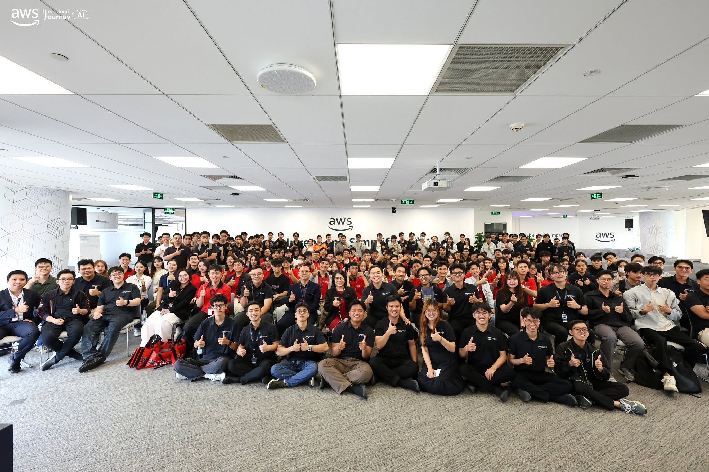

---
title: "Event 5"
date: 2026-07-04
weight: 5
chapter: false
pre: " <b> 4.5. </b> "
---

# Bài Thu Hoạch: Swinburne Cloud Mastery – Buổi Chia Sẻ Sự Nghiệp

**Ngày tổ chức:** 04 tháng 7, 2026  
**Địa điểm:** Tầng 26, tòa nhà Bitexco, TP. Hồ Chí Minh  
**Hình thức:** Tọa đàm & chia sẻ sự nghiệp trực tiếp  
**Tổ chức:** Cộng đồng First Cloud & AI Journey (FCAJ)

---

### Mục Tiêu Sự Kiện

- Cung cấp góc nhìn thực tế, từ trải nghiệm cá nhân về việc định hướng thị trường việc làm trong kỷ nguyên AI
- Chia sẻ các chiến lược cụ thể để xây dựng sự hiện diện nghề nghiệp, tận dụng mạng lưới quan hệ và nắm bắt cơ hội
- Truyền cảm hứng cho sinh viên và kỹ sư trẻ chủ động nắm lấy con đường sự nghiệp của mình
- Thảo luận về sự thay đổi trong cầu nhân lực công nghệ dưới tác động của AI

---

### Diễn Giả & Chủ Đề

| # | Diễn giả | Chủ đề |
|---|---------|-------|
| 1 | **Mr. Nguyễn Gia Hưng** | Định hướng thị trường việc làm trong kỷ nguyên AI — Visibility, Referral & Jensen Paradox |
| 2 | **Mr. Vinh Bành** | Hành trình của một Data Engineer — Giao tiếp, Nền tảng & Nắm bắt cơ hội |
| 3 | **Ms. Như Trần** | Làm thế nào để trở thành "Steve Jobs Việt Nam" — Chủ động tạo ra cơ hội |
| 4 | **Mr. Khang Nguyễn** | Đi học vs. Đi làm, AI như một công cụ học tập & Góc nhìn tuyển dụng |

---

### Nội Dung Chính

#### Phần 1 – Định hướng thị trường việc làm trong kỷ nguyên AI
*Diễn giả: Mr. Nguyễn Gia Hưng*

- **Thực trạng khắc nghiệt của thị trường:** Thế hệ hiện nay đang đối mặt với một thị trường việc làm ngày càng cạnh tranh, đòi hỏi phải tận dụng mọi lợi thế có thể — đặc biệt là **internal referral** (giới thiệu nội bộ) thông qua các cộng đồng như AWS, Rennova, NAB, v.v.
- **Mô hình kim tự tháp ngược của AI:** Khi AI tự động hóa các công việc cấp thấp, các công ty đang dịch chuyển nhu cầu tuyển dụng về phía **nhân sự cấp cao (senior)**, đồng thời cắt giảm vị trí entry-level — tạo ra mô hình kim tự tháp ngược trong cơ cấu nhân sự.
- **Nhu cầu không giảm — chỉ thay đổi:** Bất chấp AI, nhu cầu tổng thể về nhân lực công nghệ vẫn không thay đổi, thậm chí còn tăng. Ông đề cập đến **Jensen Paradox** — lý thuyết cho rằng AI tăng năng suất nhưng đồng thời tạo ra các danh mục công việc mới, ngăn ngừa tình trạng mất việc làm ròng.
- **Tăng tính visibility:** Trong thị trường cạnh tranh, chỉ giỏi thôi là chưa đủ. Cần chủ động tham gia cộng đồng, đăng dự án, xây dựng sự hiện diện nghề nghiệp rõ ràng.
- **Referral là siêu năng lực sự nghiệp:** Giới thiệu nội bộ tăng đáng kể khả năng được tuyển dụng. Đây là chiến lược bị đánh giá thấp nhất nhưng hiệu quả nhất.

---

#### Phần 2 – Hành Trình của Một Data Engineer
*Diễn giả: Mr. Vinh Bành*

- **Ít kỹ thuật, nhiều câu chuyện cá nhân:** Thay vì một bài trình bày chuyên sâu về kỹ thuật, Mr. Vinh Bành chia sẻ hành trình thực tế của bản thân — những khoảnh khắc bước ngoặt và quyết định định hình con đường sự nghiệp Data Engineer của anh.
- **Sức mạnh của referral — lần nữa:** Chính anh cũng bước vào ngành thông qua referral, củng cố thông điệp xuyên suốt buổi sự kiện: biết cách xây dựng và tận dụng mạng lưới quan hệ quan trọng không kém gì kỹ năng kỹ thuật.
- **Giao tiếp là kỹ năng kỹ thuật:** Anh thách thức quan niệm rằng kỹ năng mềm là thứ "tách biệt" khỏi kỹ năng kỹ thuật. Với anh, giao tiếp hiệu quả — với đồng nghiệp, stakeholder và quản lý — là một năng lực cốt lõi của kỹ sư.
- **Đừng coi thường nền tảng:** Các môn học đại học tưởng chừng như nhàm chán — toán học, cấu trúc dữ liệu, thuật toán, lý thuyết — hóa ra lại cực kỳ quan trọng và thiết thực trong công việc Data Engineering thực tế.
- **Nền tảng + Giao tiếp trong kỷ nguyên AI:** Khi AI ngày càng giỏi sinh code, điều phân biệt kỹ sư giỏi là chiều sâu hiểu biết và khả năng giao tiếp rõ ràng — hai thứ AI không thể thay thế.

---

#### Phần 3 – Làm Thế Nào Để Trở Thành "Steve Jobs Việt Nam"
*Diễn giả: Ms. Như Trần*

- **Talk show, không phải bài giảng:** Buổi chia sẻ của Ms. Như Trần giống như một cuộc trò chuyện cởi mở, gần gũi hơn là một bài thuyết trình formal — ấm áp, dễ gần và đầy năng lượng.
- **Công thức nắm bắt cơ hội:** Đơn giản nhưng đầy sức mạnh: **Chủ động + Tích cực + Đối diện nỗi sợ + Không ngại chia sẻ.**
- **Cơ hội không tự đến:** Cô nhấn mạnh mạnh mẽ rằng cơ hội nghề nghiệp không được trao cho ai — chúng phải được chủ động tìm kiếm. Chờ đợi thụ động "thời điểm thích hợp" chắc chắn sẽ bỏ lỡ nó.
- **Networking là gieo mầm cho tương lai:** Tham gia tích cực vào các sự kiện, meetup và cộng đồng không chỉ là "kết nối" — đó là **gieo mầm cho background nghề nghiệp trong tương lai**. Những kết nối hôm nay có thể mở ra cánh cửa nhiều năm về sau.
- **Đừng ngại chia sẻ:** Dù là dự án, ý tưởng hay thậm chí thất bại — đưa bản thân ra ngoài sẽ khuếch đại sự hiện diện nghề nghiệp và thu hút những cơ hội bất ngờ.

---

#### Phần 4 – Đi Học vs. Đi Làm, AI & Góc Nhìn Tuyển Dụng
*Diễn giả: Mr. Khang Nguyễn*

- **Trường học ≠ Đi làm:** Khoảng cách giữa học thuật và kỳ vọng thực tế rất lớn. Trường dạy giải bài toán đã được định nghĩa sẵn; công việc đòi hỏi bạn tự định nghĩa vấn đề, xử lý sự mơ hồ và tự đưa ra kết quả.
- **Dùng AI để hiểu, không phải để mù quáng copy:** Ông vạch ra ranh giới quan trọng giữa dùng AI *có ý thức* — để đào sâu hiểu biết — và dùng AI *mù quáng* — để lấy câu trả lời mà không thực sự học được gì. Cách sau tạo ra kỹ sư không giải thích được code của chính mình.
- **Nhà tuyển dụng thực sự tìm kiếm gì:** Ông chia sẻ góc nhìn từ phía người tuyển dụng — không chỉ kỹ năng kỹ thuật, mà cả cách tiếp cận vấn đề, thái độ và tiềm năng phát triển.
- **Kinh Nghiệm ≠ Trải Nghiệm:** Một phân biệt sâu sắc: có *nhiều năm kinh nghiệm* (thời gian làm việc) không bằng có *trải nghiệm thực sự* (bài học thực sự được rút ra và áp dụng). Ứng viên tốt nhất là người phản tư sâu sắc về những gì họ đã làm.
- **Câu nói tâm đắc:** *"Luck is for people who try the hardest."*

---

### Những Gì Học Được

#### Chiến Lược Sự Nghiệp & Thị Trường

- **Visibility quan trọng không kém kỹ năng:** Trong thị trường việc làm AI, không được nhìn thấy cũng như không tồn tại. Hãy xây dựng sự hiện diện qua cộng đồng, dự án và chia sẻ.
- **Referral là thị trường việc làm ẩn:** Phần lớn các vị trí được tuyển qua mạng lưới nội bộ. Đầu tư vào các mối quan hệ thực chất, không chỉ kỹ năng kỹ thuật.
- **Jensen Paradox có thật:** AI đang thay đổi *cách* làm việc, nhưng không loại bỏ *nhu cầu* về nhân lực công nghệ.

#### Nền Tảng & Tư Duy

- **Nền tảng là lợi thế cạnh tranh:** Khi AI đảm nhiệm việc code bề mặt, hiểu biết sâu về nền tảng khoa học máy tính trở thành lợi thế thực sự không thể thay thế.
- **Giao tiếp là kỹ thuật:** Khả năng giải thích rõ ràng, căn chỉnh và cộng tác là kỹ năng kỹ thuật cốt lõi — không phải "kỹ năng mềm" thứ yếu.
- **Kinh Nghiệm ≠ Trải Nghiệm:** Sự phản tư và phát triển có chủ đích quan trọng hơn số năm đi làm. Hãy khiến mọi trải nghiệm trở nên có giá trị.
- **Dùng AI thông minh:** Tận dụng AI như một công cụ học tập mạnh mẽ, không phải cái nạng bỏ qua sự hiểu biết.

---

### Áp Dụng Vào Thực Tế

- **Tham gia và duy trì hoạt động trong cộng đồng:** FCAJ, AWS và các cộng đồng tương tự không chỉ là nơi học tập — đây là mạng lưới referral và bệ phóng sự nghiệp.
- **Chủ động xây dựng visibility:** Bắt đầu ghi lại các dự án, viết về những gì học được, chia sẻ quá trình một cách công khai.
- **Ôn lại nền tảng đại học:** Quay lại cấu trúc dữ liệu, thuật toán, toán — không phải để thi, mà để xây dựng nền tảng AI không thể sao chép.
- **Thực hành dùng AI có ý thức:** Khi dùng AI tools (GitHub Copilot, ChatGPT), luôn cố gắng hiểu output trước khi dùng, không chỉ copy-paste.
- **Phản tư về các trải nghiệm đã qua:** Áp dụng lăng kính "Kinh Nghiệm ≠ Trải Nghiệm" — xác định bạn *thực sự học được gì* từ mỗi dự án và kỳ thực tập.

---

### Cảm Nhận Sự Kiện

Tham gia buổi tọa đàm tại **Swinburne Cloud Mastery** là một trải nghiệm hoàn toàn khác so với các FCAJ Meetup kỹ thuật trước đây. Thay vì đào sâu vào các dịch vụ AWS hay kiến trúc cloud, sự kiện này tập trung vào điều không kém phần quan trọng — **khía cạnh con người trong sự nghiệp công nghệ**.

#### Cú đánh thức về thực trạng thị trường

Bài chia sẻ mở đầu của Mr. Nguyễn Gia Hưng là một cú đánh thức cần thiết. Hình ảnh "kim tự tháp ngược" do AI tạo ra — nơi các công ty ngày càng ưu tiên nhân sự senior hơn entry-level — chạm đúng vào mối lo ngại thực tế của một sinh viên sắp ra trường. Nhưng việc ông đặt **Jensen Paradox** vào bối cảnh đó đã biến lo lắng thành động lực: nhu cầu đang thay đổi, và những ai thích nghi, xây dựng visibility và tận dụng mạng lưới sẽ là người chiến thắng.

#### Phần chia sẻ đáng nhớ nhất: Mr. Vinh Bành

Phần chia sẻ của anh nổi bật vì sự chân thực. Không có slide bóng bẩy hay framework hoàn hảo — anh kể lại hành trình thực tế, lộn xộn của chính mình. Nhận định *giao tiếp là kỹ năng kỹ thuật* đã thách thức một quan niệm lâu nay của tôi rằng kỹ năng mềm là thứ gì đó tách biệt khỏi kỹ thuật thực sự.

#### Năng lượng của Ms. Như Trần là có thật

Buổi chia sẻ của cô giống như một cuộc trò chuyện thực sự — như kiểu nói chuyện với mentor trong một quán cà phê, không phải diễn giả đứng trên bục. Sự đơn giản trong thông điệp chính là sức mạnh của nó: *chủ động, đối diện nỗi sợ, và đừng ngại chia sẻ*. Đây là lời nhắc nhở rằng sự nghiệp hiếm khi phát triển nhờ chờ đợi — mà nhờ tạo ra đủ nhiều khoảnh khắc để một trong số đó bứt phá.

#### Lăng kính mới về tuyển dụng: Mr. Khang Nguyễn

Sự phân biệt giữa **Kinh Nghiệm** (thời gian trải qua) và **Trải Nghiệm** (bài học thực sự học được) là ý tưởng đáng suy nghĩ nhất của cả buổi. Nó khiến tôi nhìn lại kỳ thực tập của mình — không chỉ là tôi đã làm gì, mà tôi *thực sự học được gì* và có thể diễn đạt sự trưởng thành đó như thế nào. Câu nói tâm đắc của anh, *"Luck is for people who try the hardest,"* đã đúc kết hoàn hảo tinh thần của cả buổi sự kiện.

#### Hình Ảnh Sự Kiện

> Nhìn chung, đây là một buổi sự kiện nhắc nhở mạnh mẽ rằng kỹ năng kỹ thuật là nền tảng, nhưng thành công sự nghiệp được xây dựng trên visibility, mối quan hệ, giao tiếp và tư duy chủ động. Bốn diễn giả — mỗi người một nền tảng khác nhau — đã cùng truyền đi một thông điệp nhất quán và cấp thiết: trong kỷ nguyên AI, những con người chiến thắng là những người tò mò không ngừng, xây dựng kết nối thực chất, và không bao giờ ngừng phản tư về hành trình phát triển của mình.
