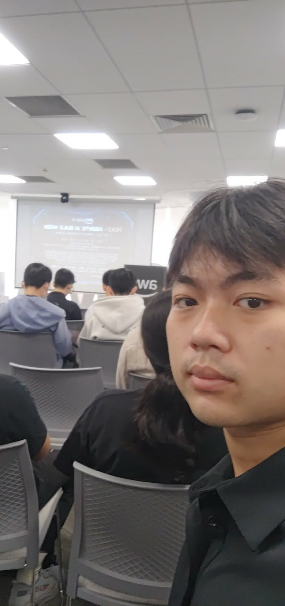
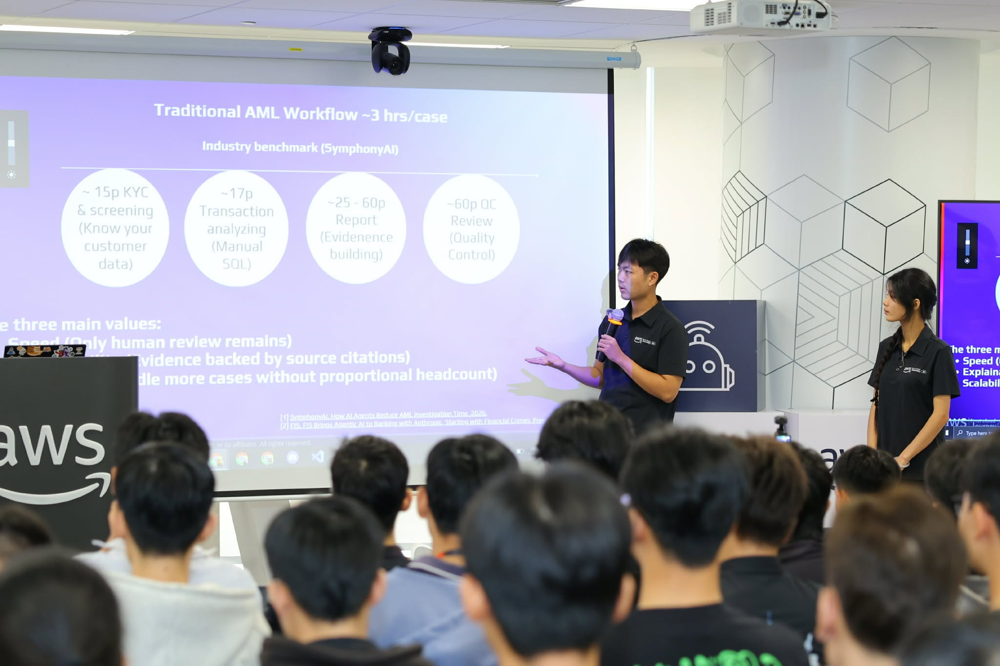

# Summary Report: FCAJ Community Day – AABW Hackathon Showcase

**Date:** July 25th 2026
**Format:** Hackathon Showcase & Community Sharing
**Location:** 26th Floor, Bitexco Tower, 02 Hai Trieu Street, Saigon Ward, Ho Chi Minh City
**Organizer:** First Cloud & AI Journey (FCAJ) Community

---

### Event Objectives

- Showcase and present results from the **Agentic AI Build Week (AABW)** hackathon
- Give teams the opportunity to share their journey, challenges, and lessons from the competition
- Inspire the FCAJ community about real-world applications of Agentic AI on AWS

---

### Presenting Teams

| # | Team | Product | Theme |
|---|------|---------|-------|
| 1 | **Six Pillars** *(my team)* | Adaptive AML/KYC Workflow Engine | Automating anti-money laundering investigation with Agentic AI |
| 2 | **3KA** | Crowd Management System | Real-time crowd monitoring using Computer Vision & AI |
| 3 | **Plan V** | SA Professional Native App | AI-powered tool to assist Solution Architects in designing AWS architectures |
| 4 | **SignalScout** | SignalScout Platform | Enterprise strategic signal intelligence powered by AI |
| 5 | **One Team** | AI-Powered Conversation Ordering | Intelligent food/service ordering via natural language AI conversation |

---

### Key Highlights

#### Session 1 – Six Pillars: Adaptive AML/KYC Workflow Engine
*Presented by Six Pillars (Bui Hoang Viet, Nguyen Lam Anh, Nguyen Van Linh, Nguyen Canh Nguyen, Nguyen Minh Nhat, Tran Phuong Huyen)*

- **The Problem:** A traditional AML investigation workflow takes approximately ~3 hours per case — involving manual KYC checks (~15 min), SQL-based transaction analysis (~17 min), report building (~25–60 min), and QC review (~60 min).
- **The Solution:** A 3-layer Agentic AI system (Fast Detection → Agentic Investigation → Case Management) that automates the entire investigative data enrichment process, leaving only the final human review step.
- **AWS Architecture:** Leverages Amazon Bedrock, AWS Lambda, DynamoDB, KMS, IAM, GuardDuty, CloudWatch, and Security Hub for enterprise-grade security and compliance.
- **Result:** Cuts processing time from ~3 hours/case to minutes, while maintaining full explainability and producing legally compliant reports.
- **Hackathon Key Takeaways:** *Scope Over Scale, Execution is Teamwork, Nothing to Lose Mindset.*

---

#### Session 2 – 3KA: Real-Time Crowd Management System
*Managing crowds with AI*

- Uses **Computer Vision** combined with **Object Tracking** to detect and monitor people in real time.
- Integrates **Agentic AI** in two roles: an *Autonomous Monitor* (detects congestion and sends proactive alerts) and an *Operator Copilot* (lets staff ask natural-language questions backed by live metrics and predictions).
- Major challenges: Maintaining reliable live video streaming, reducing inference latency, and preserving tracking consistency between frames.
- Lessons Learned: Combining real-time computer vision, cloud inference, and agentic AI into a single operational system is an extraordinarily complex engineering challenge.

---

#### Session 3 – Plan V: SA Professional Native App
*AI-powered architecture assistant*

- **The Problem:** Solution Architects must manually read through BRDs/PRDs line by line, start every architecture from a blank page, and rely on experience-dependent cost guesswork.
- **The Solution:** An AI native app that analyzes natural-language project requirements, automatically generates AWS architecture diagrams (Drawio + official AWS Icons), produces directional cost estimates for ap-southeast-1, and supports iterative refinement via a chat sidebar.
- **Impact:** From manually reading documents → Upload + chat naturally to get a Requirements Catalogue in minutes; from starting from scratch → a grounded first draft to react to and refine.

---

#### Session 4 – One Team: AI-Powered Conversation Ordering
*Intelligent ordering via natural language AI*

- **The Problem:** Traditional ordering processes require users to navigate through multiple steps and complex menus — creating an unnatural, time-consuming experience.
- **The Solution:** An AI-powered system that allows users to place orders through natural language conversation, completely eliminating the need for a traditional UI-based ordering flow.
- **Architecture:** Built with a microservices approach, addressing core challenges including service discovery and networking, observability across distributed services, and CI/CD pipelines for frequent releases.
- **Lesson Learned:** Transitioning from a monolithic to a microservices architecture allows each service to be deployed and scaled independently, reducing inter-team dependencies and dramatically accelerating development velocity.

---

#### Session 5 – SignalScout: Enterprise Strategic Signal Intelligence
*Detecting corporate strategic changes early*

- **The Problem:** Corporate strategy teams need to detect early signs of competitor strategic shifts, but relevant data is scattered across sources and lacks automated analysis tooling.
- **The Solution:** A platform that automatically collects and analyzes signals from various enterprise data sources, connecting scattered signals into a clear, evidence-backed story to support Maintain/Adapt/Accelerate decisions.
- **Architecture:** AWS Bedrock, AgentCore Runtime, DynamoDB, Amplify, Lambda, API Gateway, Cognito, CloudTrail, and more. Estimated AWS cost: ~$17–$130/month depending on scale.

---

### Key Takeaways

#### Technical & Architecture

- **Agentic AI is already here:** All four products were built around autonomous AI systems — not simple chatbots, but agents capable of planning, using tools, and executing multi-step reasoning to solve complex real-world problems.
- **Production AWS architecture is very different from academic exercises:** Every team had to make genuine engineering trade-offs: which services to use, how to balance cost and performance, how to enforce security and scalability at the same time.
- **"Scope it tiny — done well":** The consistent lesson across all teams was that delivering one small, polished feature beats shipping many half-finished ones.

#### Soft Skills & Career Growth

- **Public speaking is a trainable skill:** Presenting as a speaker for the first time in front of a real community was nerve-wracking — but getting through it delivered a tangible boost in confidence and communication ability.
- **A hackathon is a compressed learning environment:** It's not just a technical competition — it's where you learn to collaborate under pressure, make fast decisions, and ship something real in an extremely short time.

---

### Event Experience

This was the most memorable event of my entire internship — not because I was the one listening, but because for the first time, **I was the one speaking**.

Standing in front of the FCAJ community to share the Six Pillars hackathon journey was a completely different experience from anything I'd done before. I had to organize a compelling story, prepare the content, and deliver it clearly to a real audience — not a simulated classroom exercise. The nerves before starting were real, but as I began speaking, things gradually flowed more naturally. That was the moment I realized that *courage isn't the absence of fear — it's acting despite it*.

Beyond our own presentation, listening to the other three teams was equally valuable. Each team approached their problem differently — in architecture, technology, and problem framing — but they all converged on one insight: **Agentic AI is ushering in a new era of software**, where applications don't just respond — they actively take initiative.

#### Event Photos

> Looking back, Event 6 crystallized everything I had been building throughout my internship: the technical knowledge from the meetups, the hands-on experience from AABW, and the communication skills from having to stand up and share in front of a community. This wasn't just the end of a journey — it was the beginning of a new kind of confidence.
